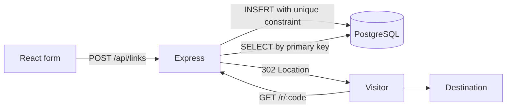

# Architecture decisions

Status: implemented local portfolio application. Repository visibility is separate
from service deployment; no public service is deployed. There are no accounts,
analytics or AI features.

## One application, one source of truth

React renders the form; Express serves the API, redirects and compiled frontend
from one origin. Vite runs as Express middleware only during development.
PostgreSQL stores links. A single package and lockfile keep setup small.

`app.ts` owns HTTP behavior; `links.ts` validates destinations and inserts codes;
`db.ts` creates the pool. `main.ts` owns startup, signals and asset serving;
`shutdown.ts` drains HTTP before ending the pool. Tests can mount the same app
without a fixed port. No generic repository layer or separate service is needed
for one table and two link operations.

## Random codes and database-enforced uniqueness

Nine cryptographically random bytes produce 12 base64url characters (72 bits).
This avoids a public sequential counter and a separate ID allocation service.
Codes are not authentication credentials and must not be treated as access control.

`links.code` is the primary key. INSERT uses ON CONFLICT DO NOTHING and retries
at most three times; it never checks existence first or overwrites another link.
PostgreSQL arbitrates concurrent conflicts. Exhaustion and database failures
return a generic 503; only collisions are retried. Repeated destinations may
produce different codes: deduplication has no requirement in this delivery.

## PostgreSQL and explicit SQL migrations

The stored destination is the source of truth across backend restarts. SQL keeps
the small data model and transaction boundaries visible without an ORM. Values
are parameterized; a unique key supports direct lookups.

Versioned migrations run explicitly, in one transaction with an advisory lock,
and record applied filenames. They are not run from request handlers. This is
sufficient for a local app; migrations have no checksum verification or automatic
rollback command. Production changes will need a backup/recovery strategy and
compatibility planning. Existing migration files must not be rewritten.

## Temporary, uncached redirects

GET /r/:code returns 302 with Cache-Control: no-store. The server remains in the
resolution path instead of committing clients to a permanent cached 301. This
keeps future expiry or revocation possible, but neither feature is implemented.
Each visit costs a database lookup; the project makes no throughput claims.

Destinations accept HTTP(S), exclude credentials and limit input length. Validation
does not certify a destination as safe. The backend never downloads the URL;
the visitor's browser follows Location, preserving path, query and fragment.
BASE_URL controls generated links independently of an untrusted Host header.

## Rate limiting before database access

Use express-rate-limit on the creation and redirect routes, before JSON parsing
and database access. Separate 60-second quotas allow 30 creation attempts and
120 redirect attempts per client IP; failed attempts count too. These are initial
portfolio defaults, not measured capacity targets. Health checks remain exempt.
The library handles window expiry, retry headers and IPv6 /56 grouping without
custom security-sensitive counter or address parsing code.

Each application owns its in-memory counters. Restarting clears them; multiple
processes would multiply the effective allowance. A shared store or ingress
policy is required before scaling. Proxy trust stays disabled: client-supplied
forwarding headers cannot change the quota key. A future proxy deployment must
define and verify its trusted hops. NAT users share quotas. IPs are held only in
temporary counters, never added to logs or PostgreSQL. This is a basic abuse
control, not protection against distributed attacks.

References: [CodeQL guidance](https://codeql.github.com/codeql-query-help/javascript/js-missing-rate-limiting/)
and [limiter configuration](https://express-rate-limit.mintlify.app/reference/configuration).

## No cache, queues or distributed services

The indexed lookup is adequate for the demonstrated flow. Redis would add stale
data, invalidation and another service before measurements justify it. Add caching
only after profiling shows database reads are a bottleneck and cache correctness
requirements are defined. Background jobs likewise have no current consumer.

## Verification and operation boundaries

Unit tests cover validation/configuration and clipboard behavior. Integration
tests use a separate PostgreSQL instance and a fresh schema per data test, with
guards preventing cleanup of development data. Chromium tests use real routes,
built React assets and local destinations on ephemeral ports. They mount the app
rather than launching main. Startup validation is tested separately, and Linux CI
starts the compiled main process to verify real signals and the shutdown deadline.

Request logs use generated IDs, route templates, status and duration; raw URLs,
headers, bodies and codes are omitted. Shutdown drains requests and closes the
pool, with a 10-second forced-exit limit. Development cleanup and HTTP draining are
both awaited even when one fails, so the pool cannot close prematurely. Health
reports liveness, not readiness.

CI verifies the local contract, not production readiness. Current limits include
Chromium-only automation, no screen-reader audit or load test, and no verification
of interactive Windows Ctrl+C. Linux process signals are covered in CI.
Before public deployment, define abuse
controls, authentication/ownership if needed, TLS, backups, readiness and operating
budgets. Any AI capability needs a useful scope, evaluation set and cost/data
boundaries before choosing a provider.
