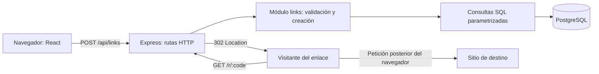
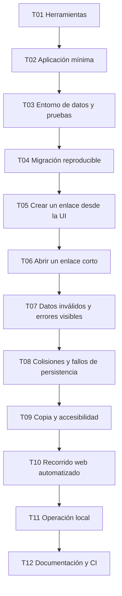

# Plan: URL Shortener

Estado: borrador para discutir. Solo planificación; ninguna tarea de desarrollo
ha comenzado. Fuente de requisitos: [SPEC.md](../SPEC.md).
Lista de tareas: [todo.md](todo.md), única fuente del estado de implementación.

## Objetivo y alcance

Crear evidencia pública de ingeniería full stack mediante un producto pequeño
que pueda ejecutarse, probarse y explicarse. El primer hito propuesto es local:
crear un enlace desde la interfaz, persistirlo y abrir su destino.

Decidido por el usuario: TypeScript y Node.js. Las siguientes decisiones son
propuestas revisables. No estimamos fechas sin acordar dedicación y alcance.

## Arquitectura propuesta

Monolito modular con un proceso backend y una base de datos. Un único paquete npm
y archivo de bloqueo simplifican la instalación. React es el cliente web;
Express concentra HTTP; PostgreSQL mantiene los enlaces.

El navegador visita el destino tras recibir la redirección. El backend no
descarga páginas externas, por lo que el núcleo no necesita un cliente HTTP
para procesar URLs ni un sistema de extracción de contenido.

### Responsabilidades y límites

| Elemento | Responsabilidad | Decisión propuesta y motivo |
|---|---|---|
| `src/client` | Formulario, estados y copia | React + Vite; coincide con la experiencia del portfolio |
| `src/server/app.ts` | Montar rutas y manejar errores HTTP | Express 5; sin lógica de dominio en el arranque |
| `src/server/links.ts` | Validar, generar códigos y coordinar persistencia | Funciones explícitas; extraer archivos solo cuando resulte útil |
| `src/server/db.ts` | Pool y consultas parametrizadas | `pg`; SQL visible y sin repositorio genérico |
| `src/server/main.ts` | Configuración, arranque y cierre | Separado de la aplicación para probar sin abrir un puerto fijo |
| `db/migrations` | Evolución del esquema | SQL versionado, historial y ejecución explícita |

No se necesitan microservicios, colas ni Redis para demostrar este flujo.
Reconsiderar caché solo después de medir las consultas y detectar una necesidad.

### Datos

Tabla inicial propuesta `links`:

| Columna | Tipo | Regla |
|---|---|---|
| `code` | `varchar(12)` | Clave primaria; código aleatorio base64url de 9 bytes |
| `destination_url` | `text` | No nula; validada antes de persistir |
| `created_at` | `timestamptz` | No nula, generada al insertar |

Una sola identidad (`code`) basta para este alcance. No deduplicar destinos:
dos creaciones pueden generar dos enlaces diferentes. No añadir anticipadamente
columnas de usuarios o analítica. Incorporarlas con migraciones cuando se defina
su comportamiento. El índice de la clave primaria resuelve la búsqueda por código.

Propuesta: hasta 3 intentos de inserción ante conflicto de clave; distinguir ese
conflicto de otros errores de base de datos. No consultar primero si el código
existe: la restricción única arbitra las creaciones concurrentes.

### HTTP y configuración

El contrato funcional está en SPEC.md. Refinamientos propuestos:

- `POST /api/links`: 201 al persistir, 400 para datos inválidos, 413 para JSON
  demasiado grande y 503 si la persistencia no está disponible o se agotan
  los reintentos. Errores JSON con `error.code` y `error.message` estables.
- `GET /r/:code`: 302, `Cache-Control: no-store`; 404 para códigos mal formados
  o inexistentes; 503 para fallo de persistencia. Una consulta directa por código.
- La validación usa `URL`, limita la entrada y acepta únicamente HTTP/HTTPS sin
  credenciales. No se presenta como comprobación de que el destino sea seguro.
- JSON limitado a 8 KiB. `BASE_URL` configura el origen público; `DATABASE_URL`
  y `PORT` se validan al arrancar. Credenciales únicamente en el entorno.
- En desarrollo, Vite reenvía `/api` y `/r` a Express. El enlace generado usa el
  origen de Vite. En el build local, Express sirve también el frontend.
- Las rutas API y de redirección se resuelven antes de servir la interfaz;
  una ruta API desconocida no devuelve accidentalmente el HTML de React.

### Operación y límites

Docker Compose proporciona PostgreSQL local con volumen persistente. Las pruebas
de integración usan una base distinta, identificada explícitamente mediante
`TEST_DATABASE_URL`; se rechaza ejecutar limpieza contra la base de desarrollo.
Las migraciones se aplican antes de arrancar, no como efecto de cada petición.

Logs del backend con identificador de petición, ruta sin query, estado y duración;
no registrar destinos completos, cuerpos ni secretos. Cerrar servidor y pool
ordenadamente al terminar el proceso. No incorporar todavía una plataforma de
observabilidad ni afirmar objetivos de rendimiento sin mediciones.

## Dependencias y orden de construcción

T01–T04 son la preparación mínima; no construyen funcionalidades futuras.
T05 y T06 recorren datos, API y experiencia del usuario. A partir de T06 se puede
demostrar el caso principal. T07–T12 lo hacen más fiable y reproducible.
Revisar resultados cada dos tareas, sin marcar ninguna como hecha por compilar.

Este orden favorece trabajo secuencial y comprensión del proyecto. Más adelante,
documentación y revisión visual podrían avanzar de forma independiente sobre
contratos estables. No se asignan agentes ni se ejecuta trabajo paralelo ahora.

## Definición de terminado para una tarea futura

- Criterios de aceptación satisfechos y comportamiento verificado en ejecución.
- Pruebas relevantes de comportamiento y regresión pasan; tipos, lint y build
  pasan cuando sus herramientas estén configuradas.
- Errores visibles y controlados; entradas y secretos tratados correctamente.
- Documentación actualizada cuando cambia un contrato, comando o decisión.
- Evidencia registrada de lo comprobado y de cualquier limitación pendiente.
- Cambios pequeños revisables, sin funcionalidad ajena a la tarea.

## Riesgos y decisiones pendientes

| Riesgo o incógnita | Impacto | Tratamiento propuesto |
|---|---|---|
| Stack adicional aún no aprobado | Retrabajo | Revisar Express, React/Vite, PostgreSQL y SQL directo antes de implementar |
| Docker no disponible localmente | Bloquea integración | Comprobar al iniciar; alternativa PostgreSQL instalado localmente |
| Acortador público usado para abuso | Alto | Mantener primer hito local; definir límites de uso, bloqueo y reporte antes de publicar |
| Reinicios o concurrencia pierden datos | Alto | Persistencia real, clave única y pruebas tempranas |
| Pruebas borran datos de desarrollo | Alto | Base de pruebas explícita y comprobación antes de limpiar |
| Portfolio acumula funcionalidades sin acabar | Alto | Terminar y demostrar el núcleo antes de ampliar |
| IA sin utilidad ni evaluación | Medio | Elegir caso de uso y criterios antes de añadir proveedor o agente |

## Hoja de ruta posterior, todavía sin desglosar

1. Cuentas y gestión privada: decidir proveedor o sesiones, permisos y
   operaciones sobre enlaces. Se apoya en el núcleo.
2. Analítica: definir qué representa un clic, tratamiento de bots, retención
   y privacidad. Se apoya en redirecciones y permisos.
3. IA: posible consulta de estadísticas en lenguaje natural, pendiente de
   confirmar. Exigir acceso limitado por usuario, evaluación y presupuesto.
4. Demo pública: elegir hosting, presupuesto, protección frente a abuso,
   backups y señales operativas. Documentar mediciones y limitaciones reales.

Estos puntos no son tareas autorizadas ni dependencias del primer hito local.
La publicación de código y la exposición pública del servicio son decisiones
distintas; el repositorio puede documentarse antes de desplegar el servicio.

## Preguntas para la siguiente revisión

- ¿El primer hito local descrito encaja con el producto que Matteo quiere mostrar?
- ¿Mantener el stack propuesto o comparar alguna alternativa concreta?
- ¿La IA formará parte del producto, del proceso de desarrollo o de ambos?
- ¿Qué dedicación y presupuesto condicionarán las entregas posteriores?

No iniciar desarrollo al cerrar estas preguntas: el usuario ha pedido seguir
planeando. Se requiere una petición posterior para pasar a implementación.
